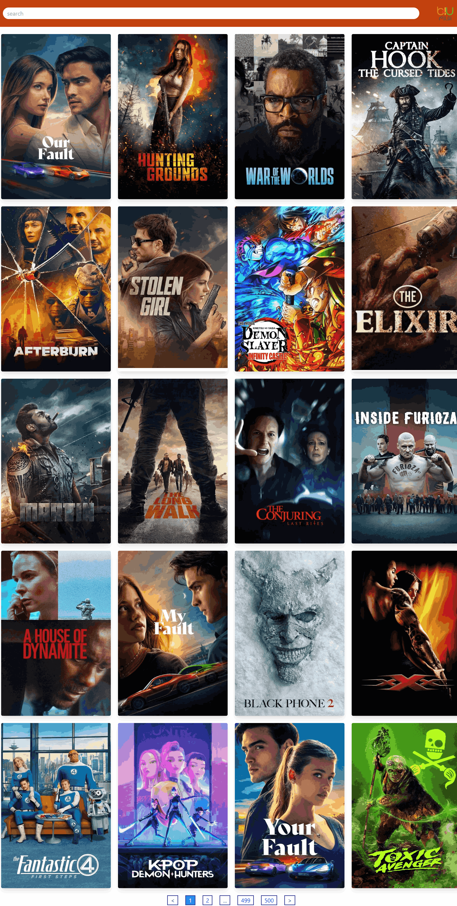
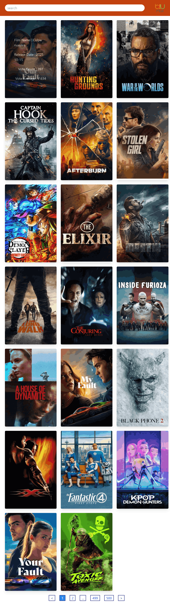
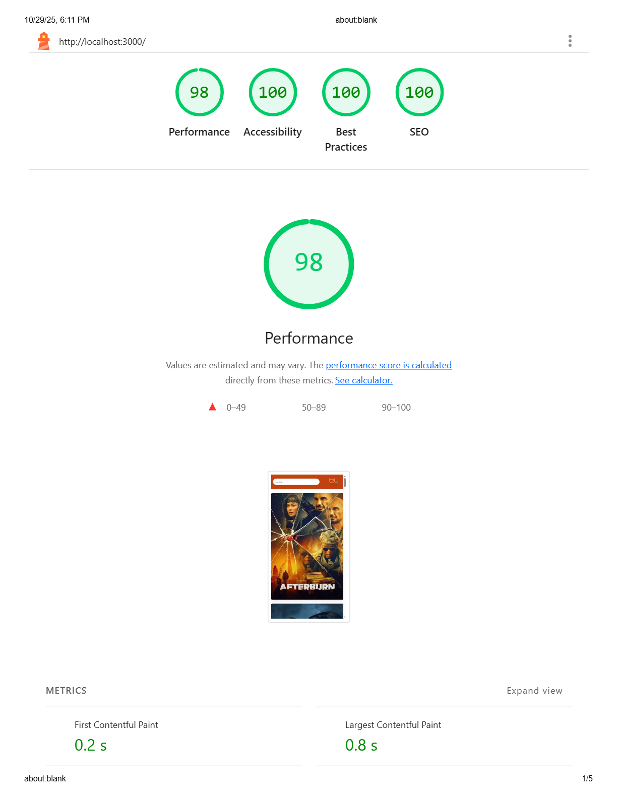

# 🎬 Movie Explorer App

A responsive movie browser built with **React**, **Redux**, and **Tailwind CSS**, powered by the **TMDb API**.  
Users can search for movies, browse by popularity, and view detailed information for each movie.

---

🚀 Live Demo

👉 https://ahmednabil22224.github.io/Movie_Website/

---

## 🚀 Features

- 🔍 Search movies by title
- 📄 Pagination for browsing results
- 🎞️ Detailed movie pages (title, release date, votes, overview)
- 💾 State management with Redux + Thunk
- ⚡ Fast styling with Tailwind CSS
- 🧭 Client-side routing using React Router

---

## 🛠️ Technologies Used

- **React** – UI library
- **Redux** – State management
- **Redux Thunk** – Async data fetching
- **React Router DOM** – Navigation
- **Axios** – HTTP requests
- **React Paginate** – Pagination UI
- **Tailwind CSS** – Styling framework

---

## 📦 Installation

1. **Clone the repository**

   ```bash
   git clone https://github.com/ahmednabil22224/Movie-Website.git

   ```

2. Install dependencies
   npm install

3. Create .env file
   VITE_TMDB_API_KEY=YOUR_API_KEY

4. Run locally
   npm start

5. Open http://localhost:3000
   in your browser.

6. Build for production
   npm run build

---

📁 Folder Structure

```
src/
├── components/
│   ├── Header.jsx
│   ├── Movie.jsx
│   ├── Pagination.jsx
├── pages/
│   ├── AllMovies.jsx
│   ├── Details.jsx
├── redux/
│   ├── reducer.js
│   ├── store.js
├── App.jsx
├── index.jsx
└── styles/
    └── tailwind.css
```

---

## 📸 Preview

**Desktop View**


**Tablet View**


**Mobile View**
<div align="center">
  
</div>

=======

---

## 🌟 Lighthouse Report

| Metric            | Score |
| ----------------- | ----- |
| ⚡ Performance    | 98%   |
| ♿ Accessibility  | 100%  |
| 🛡️ Best Practices | 100%  |
| 🔍 SEO            | 100%  |

images/lighthouse-report.png

## ⚡ Lighthouse Report



---
